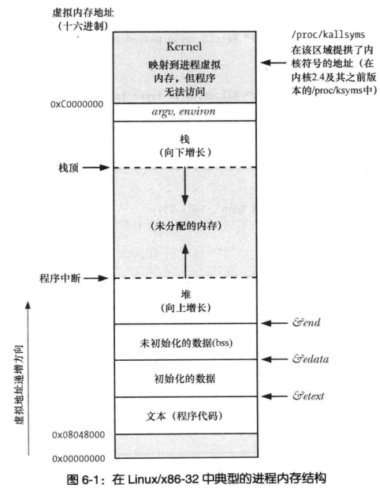
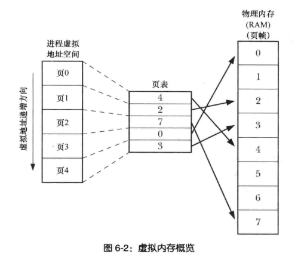

# 进程

### 概念

书中关于进程的定义：

> 进程是由内核定义的抽象的实体，并为该实体分配用以执行程序的各项资源。
>
> 从内核角度看，进程由用户内存空间和一系列内核数据结构组成，其中用户内存空间包含了程序代码以及代码所使用的变量，而内核数据结构则用于维护进程的状态信息。记录在内核数据结构中的信息包括与进程相关的标识号、虚拟内存表、打开文件的描述符表、信号传递及处理的有关信息、进程资源使用及限制、当前工作目录和大量其他信息。

### 进程内存布局

内核分配给进程的内存由段组成，包括：文本段、初始化的数据段、未初始化的数据段、栈和堆（有部分段和ELF格式的目标文件中的段相同，应该多少有点关联）。下图为Linux/x86-32中的典型的进程内存结构：

* 文本段中存放了进程运行时用到的机器指令。

* 初始化数据段存放这已经初始化的全局变量和静态变量。

* 未初始化的数据段也称为BSS段，存放未初始化的全局变量和静态变量。

* 堆中存放着内存是动态分配的变量。

* 栈中存放着自动变量（这里的栈和数据结构中的栈是一样的）。

**关于栈和栈帧**

栈由栈帧组成，会有一个栈指针指向栈顶。每次调用函数时，系统会在栈顶上为其分配一个栈帧，栈帧中存放当前运行环境的一些状态信息（包括下一条执行的指令，便于函数调用结束后返回），调用函数的实参和自动变量；当函数返回时，移除一个栈帧，实际上栈段的大小并没有变小，只是通过移动栈指针逻辑上减小了栈。

### 虚拟内存

> 程序的局部性原理：
>
> * 空间局部性：指程序倾向于访问最近访问过的内存地址附近的内存。
> * 时间局部性：指程序倾向于在不久将来再次访问最近刚访问过的内存地址。

虚拟内存管理技术将进程所需的存储空间分割成固定大小的页，将内存也分割成相同大小，称为页帧。虚拟内存利用了程序的局部性原理，内核不需要将进程运行所需的所有页都载入内存，只在需要时从磁盘的交换区载入。为了实现虚拟内存管理技术，内核需要为每一个进程维持一张页表，页表存储了进程虚拟内存地址到物理内存地址的映射、页是否存在于内存中以及页是否修改等信息，虚拟内存地址到物理内存地址的转换是由硬件中的分页内存管理单元（PMMU）完成。下图为虚拟内存概览：

